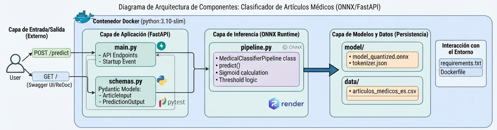
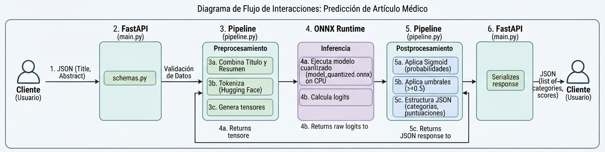
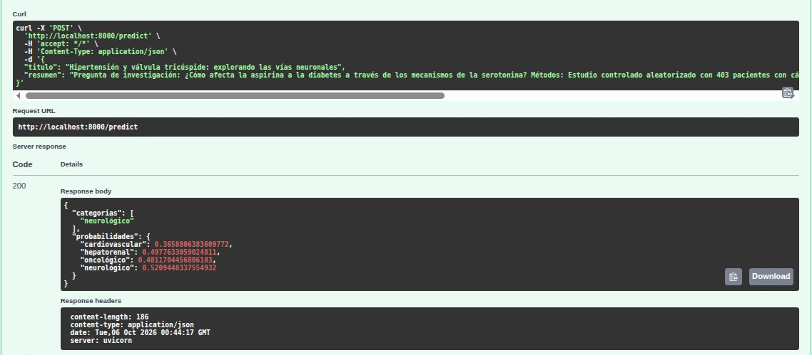

## 🚀 API para Clasificación de Artículos Médicos con NLP


Solución de Procesamiento de Lenguaje Natural (**NLP**) para la clasificación multietiqueta de artículos médicos en español (cardiovascular, hepatorenal, oncológico, neurológico). Diseñada bajo estrictas restricciones de recursos, optimizada para ejecutarse con alta eficiencia en arquitecturas de CPU limitadas (**Render Free Tier: 512 MB RAM**).

---

## 🌟 Características Principales

* **Modelo Optimizado con ONNX Runtime:** Conversión y cuantización del modelo base `dccuchile/albert-base-spanish` a formato ONNX, reduciendo drásticamente el uso de memoria RAM y acelerando los tiempos de inferencia.

* **Clasificación Multietiqueta:** Capacidad de predecir una o múltiples categorías médicas simultáneamente utilizando función sigmoide y umbrales de confianza dinámicos.

* **Despliegue Cloud-Ready:** Contenedor Docker liviano basado en `python:3.10-slim` optimizado para despliegues automáticos en Render y otras plataformas PaaS.

* **Calidad y Pruebas Robustas:** Suite completa de pruebas automatizadas mediante `pytest` y `FastAPI TestClient`.

* **Automatización CI/CD:** Workflow integrado en GitHub Actions para ejecución manual de pruebas y validación continua.

---

## 📂 Estructura del Proyecto

```text
nlp-medical-classifier/
├── .github/
│   └── workflows/
│       └── pytest.yml          # Pipeline de integración continua (CI)
├── app/
│   ├── __init__.py
│   ├── main.py                 # Endpoints de FastAPI y ciclo de vida de la app
│   ├── schemas.py              # Validación de esquemas de entrada/salida con Pydantic v2
│   └── pipeline.py             # Lógica de preprocesamiento, tokenización e inferencia ONNX
├── tests/
│   └── test_main.py            # Pruebas unitarias y de integración con Pytest
├── data/
│   └── articulos_medicos_es.csv # Dataset fuente de entrenamiento/evaluación
├── docs/
│   ├── diagrama_arquitectura_de_componentes.jpeg  # Arquitectura de Componentes
│   └── diagrama_de_flujo_de_interacciones.jpeg    # Flujo de Interacciones
├── model/
│   ├── tokenizer.json          # Tokenizador optimizado para ALBERT
│   └── model_quantized.onnx    # Modelo en formato ONNX cuantizado
├── Dockerfile                  # Configuración de contenedorización multipropósito
├── requirements.txt            # Dependencias del proyecto fijadas por versión
└── README.md                   # Documentación oficial del portafolio
```

---

## 🛠️ Stack Tecnológico

| Componente | Tecnología | Propósito |
| :--- | :--- | :--- |
| **Framework API** | `FastAPI` | Desarrollo de endpoints asíncronos de alto rendimiento y documentación interactiva (Swagger/OpenAPI). |
| **Validación** | `Pydantic v2` | Modelado de datos robusto y tipado estricto en tiempo de ejecución. |
| **Inferencia NLP** | `ONNX Runtime` | Motor de ejecución optimizado para modelos de Deep Learning sin dependencias pesadas de PyTorch. |
| **Tokenización** | `Hugging Face Tokenizers` | Tokenización en C++ ultra rápida para procesamiento de textos médicos. |
| **Contenedor** | `Docker` | Empaquetado reproducible y aislado para producción. |
| **Testing** | `Pytest` | Validación automatizada del comportamiento de la API. |

---

## 🏗️ Arquitectura y Flujo del Sistema

La solución está diseñada con una arquitectura desacoplada y liviana para garantizar un rendimiento óptimo en entornos con recursos reducidos.

### 1. Arquitectura de Componentes

*Arquitectura del Sistema: Muestra la organización modular de la aplicación dentro del contenedor Docker. Detalla cómo interactúan la capa de entrada (FastAPI y Pydantic), el pipeline de procesamiento y el modelo optimizado mediante ONNX Runtime (model_quantized.onnx), diseñado específicamente para ajustarse al límite de 512 MB de RAM de Render.*

### 2. Flujo de Interacciones (Pipeline de Inferencia)

*Flujo de Inferencia: Ilustra el ciclo de vida de una solicitud de predicción (/predict). Desde que el cliente envía el título y resumen en formato JSON, pasa por la validación de Pydantic, el preprocesamiento y tokenización, la ejecución de la inferencia en CPU mediante ONNX, hasta la aplicación de umbrales sigmoidales y la devolución estructurada de las probabilidades multietiqueta.*

---

## ⚙️ Guía de Instalación y Ejecución Local

### Prerrequisitos
* Python 3.10 o superior instalado.
* Git.

### 1. Clonar el repositorio
```Bash
git clone https://github.com/Diego-Uzc-J/API-Clasificacion-de-Articulos-Medicos-con-NLP.git
cd nlp-medical-classifier
```

### 2. Crear y activar entorno virtual
```Bash
python3 -m venv venv

# En Windows:
venv\Scripts\activate

# En Linux/macOS:
source venv/bin/activate
```

### 3. Instalar dependencias
```Bash
pip install --upgrade pip
pip install -r requirements.txt
```

### 4. Ejecutar la aplicación localmente
```Bash
uvicorn app.main:app --reload --port 8000
```

Una vez iniciado, puedes acceder a la documentación interactiva en:

* Swagger UI: http://localhost:8000/docs
* ReDoc: http://localhost:8000/redoc

---

## 🧠 Entrenamiento y Generación del Modelo ONNX

Dado que el repositorio de producción está optimizado para consumir pocos recursos, los archivos binarios pesados del modelo no se incluyen por defecto en el control de versiones. Puedes generar el modelo cuantizado y el tokenizador localmente a partir de tu dataset siguiendo estos pasos:

1. Asegúrate de tener el **dataset fuente** en su ubicación correspondiente:
```text
   data/articulos_medicos_es.csv
```
   
2. Coloca el **script auxiliar** `export_model.py` en la raíz del proyecto.

3. Instala las **dependencias de Machine Learning** necesarias (PyTorch, Transformers, Scikit-learn y ONNX):
```Bash
pip install scikit-learn transformers torch onnx onnxruntime onnxscript
```

4. **Ejecuta el script** de exportación y cuantización:
```Bash
python3 export_model.py
```

Este proceso entrenará o ajustará el modelo `dccuchile/albert-base-spanish` con las categorías multietiqueta de tu dataset, lo exportará al formato ONNX y aplicará cuantización dinámica de 8 bits para garantizar que la API cumpla estrictamente con el límite de **512 MB de RAM de Render Free**. Los archivos generados se guardarán automáticamente en la carpeta `model/`.

---

## 🧪 Ejecución de Pruebas

Para verificar el correcto funcionamiento del sistema mediante la suite de pruebas unitarias:

```Bash
PYTHONPATH=. pytest -v
```

## 🐳 Ejecución con Docker

Puedes construir y ejecutar el contenedor localmente simulando el entorno de producción de Render:
```Bash
# Construir la imagen Docker
docker build -t nlp-medical-classifier .

# Ejecutar el contenedor mapeando el puerto 8000
docker run -d --name medical-classifier-app -p 8000:8000 nlp-medical-classifier
```


## 🔌 Ejemplo de Consumo de la API

**Petición POST** (/predict)

**URL:** http://localhost:8000/predict

**Body (JSON):**
```JSON
{
  "titulo": "Hipertensión y válvula tricúspide: explorando las vías neuronales",
  "resumen": "Pregunta de investigación: ¿Cómo afecta la aspirina a la diabetes a través de los mecanismos de la serotonina? Métodos: Estudio controlado aleatorizado con 403 pacientes con cáncer, que evaluó la enfermedad de Parkinson y la mielopatía. Resultados: Mejora del manejo de la enfermedad. Implicaciones: Avances en la atención médica."
}
```

**Respuesta esperada (JSON):**
```JSON
{
  "categorias": [
    "neurológico"
  ],
  "probabilidades": {
    "cardiovascular": 0.3658806383609772,
    "hepatorenal": 0.4977633059024811,
    "oncológico": 0.4811704456806183,
    "neurológico": 0.5209448337554932
  }
}
```




---
*Creado por Ing. Diego A. Uzcátegui J. | www.linkedin.com/in/diego-uzc-j | Portafolio Profesional*


